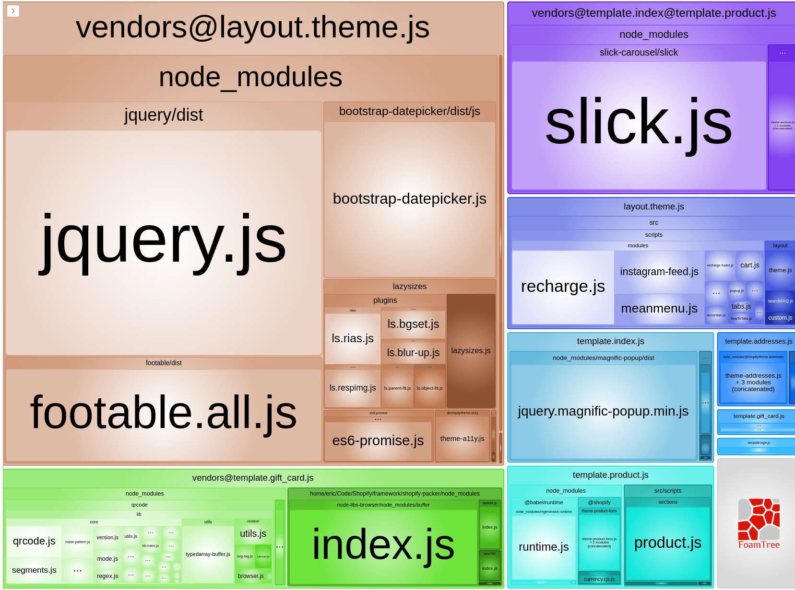

# Shopify Packer
Shopify development tool using themekit and webpack. Also a drop in replacement for Slate.

1. [Features](#features)
2. [Install](#install)
3. [Quick Start](#quick-start)
4. [Commands](#commands)
5. [Configuration](#vonfiguration)
6. [Concepts](#voncepts)
    1. [Theme structure](#theme-structure)
    2. [Local development](#local-development)
    3. [SSL](#ssl)
    4. [Styles with Liquid](#styles-with-liquid)
    5. [Template and layout bundles](#template-and-layout-bundles)
    6. [Asset minification](#asset-minification)
    7. [Modify webpack config](#modify-webpack-config)
7. [Themes](#themes)
    1. [List](#list)
    2. [Create](#create)
    3. [Remove](#remove)
    4. [Download](#download)

## Features
- Webpack 4
- Stylelint
- ESLint
- Babel
- PostCSS
- SCSS
- Analyze Bundles
- Liquid code in stylesheets
- Webpack config is easy to modify (use `dev.config.js` and `prod.config.js`)
- App server loads scripts and stylesheets locally
- Hot Module Reloading for rapid development
- Multiple entrypoints for templates and layouts
- List themes on store
- Delete themes from CLI
- Create new empty theme in Shopify from CLI, adds theme id to config.json
- Download existing themes
- Download files/sync changes
- Init base packer theme from cli or use a custom github repo

## Install
```bash
npm i @hayes0724/shopify-packer -g
```
```bash
yarn global add @hayes0724/shopify-packer
```

## Quick Start

### New project
1. Create new project with all required files
```
packer init <dirname>
```
2. Add app password and store url to config.json

3. Create new empty theme on shopify
```
packer theme:create
```
4. Deploy files and start working
```
packer start
```


## Commands

List of all API commands for Packer:
- [init](#init)
- [start](#start)
- [watch](#watch)
- [deploy](#deploy)
- [build](#build)
- [lint](#lint)
- [format](#format)
- [zip](#zip)
- [theme:list](#theme:list)
- [theme:create](#theme:create)
- [theme:remove](#theme:remove)
- [theme:download](#theme:download)
- [help](#help)

### init
Creates a blank start theme in specified directory. By default, it will use `hayes0724/packer-blank-theme` 
unless you specify the repo flag with the name of the themes github repo. It will pull the latest release and fail 
if the custom theme repo has no releases.
```
packer init <dir> [--repo=hayes0724/packer-blank-theme]
``` 
### start
Compiles your local theme files into a dist directory, uploads these files to your remote Shopify store and finally
boots up a local Express server that will serve most of your CSS and JavaScript.
```bash
packer start [--env=my-custom-env-name] [--skipPrompts] [--skipFirstDeploy]
```

| &nbsp; &nbsp; &nbsp; &nbsp; &nbsp; &nbsp; &nbsp; Flag &nbsp; &nbsp; &nbsp; &nbsp; &nbsp; &nbsp; &nbsp; | Description |
| --- | --- |
| `--env` | Targets a custom environment. Setting --env=production would use the production settings in config.json |
| `--skipPrompts` | Skips all prompts. This is especially useful when using Packer with continuous integration tools |
| `--skipFirstDeploy` | Skips the file upload sequence and simply boots up the local Express server |

### watch
Same as start command except it skips the first deployment
```bash
packer watch [--env=my-custom-env-name] [--skipPrompts]
```
### deploy
Uploads the dist folder to the Shopify store.
```bash
packer deploy [--env=my-custom-env-name] [--skipPrompts] [--replace]
```
| &nbsp; &nbsp; &nbsp; &nbsp; &nbsp; &nbsp; &nbsp; Flag &nbsp; &nbsp; &nbsp; &nbsp; &nbsp; &nbsp; &nbsp; | Description |
| --- | --- |
| ``--env`` | Targets a custom environment. Setting --env=production would use the production settings in config.json |
| ``--skipPrompts`` | Skips all prompts. This is especially useful when using Packer with continuous integration tools |
| ``--nodelete`` | By default deploy will replace all files in theme, use this flag to update without removing existing files |
### build
```bash
packer build [--analyze]
```
| Flag | Description |
| --- | --- |
| ``--analyze`` | Analyzes bundles |

Builds a production-ready version of the theme by compiling the files into the dist folder.
### lint
```bash
packer lint [--scripts] [--styles] [--locales]
```
| Flag | Description |
| --- | --- |
| ``--scripts`` | Runs linting only on script files |
| ``--styles`` | Runs linting only on style files |
| ``--locales`` | Runs linting only on locales files |
### format
Formats the theme code according to the rules declared in the .eslintrc and .stylelintrc files. By default, it uses 
ESLint Fix to format JS files, Stylelint Fix to format CSS files and Prettier to format JSON files.
```bash
packer format [--scripts] [--styles] [--json]
```
| Flag | Description |
| --- | --- |
| ``--scripts`` | Runs formatting only on script files |
| ``--styles`` | Runs formatting only on style files |
| ``--locales`` | Runs formatting only on locales files |
### zip
Compiles the contents of the dist directory and creates a ZIP file in the root of the project.
```bash
packer zip
```
### theme:list
Lists all themes (shows name, themeID, etc...) on the site, requires app password and store url be set first. By default looks at the store for development env in config.json
```bash
packer theme:list
```
| Flag | Description |
| --- | --- |
| ``--env`` | Targets a custom environment. Setting --env=production would use the production settings in config.json |
### theme:create
Creates a new empty theme on Shopify and updates config.json for the selected env with the proper themeID
```bash
packer theme:create
```
| &nbsp; &nbsp; &nbsp; &nbsp; &nbsp; &nbsp; &nbsp; &nbsp; &nbsp; Flag &nbsp; &nbsp; &nbsp; &nbsp; &nbsp; &nbsp; &nbsp; &nbsp; &nbsp; | Description |
| --- | --- |
| ``--env`` | Targets a custom environment. Setting --env=production would use the production settings in config.json |
| ``--name=my-theme-name `` | Sets the theme name on Shopify, it's required |
### theme:remove
Removes the theme set in the selected env from Shopify
```bash
packer theme:remove
```
| Flag | Description |
| --- | --- |
| ``--env`` | Targets a custom environment. Setting --env=production would use the production settings in config.json |

### theme:download
Downloads the theme set in the selected env from Shopify
```bash
packer theme:download
```
| Flag | Description |
| --- | --- |
| ``--env`` | Targets a custom environment. Setting --env=production would use the production settings in config.json |


### help
Display all commands and flags
```bash
packer help
```

## Configuration
All settings are located in ``config.json`` in the root directory. 

```json
{
  "network": {
    "ipAddress": null,
    "external": false,
    "interface": null
  },
  "themes": {
    "development": {
      "id": "74500041118",
      "password": "ebd6ce7f27aae8cdafb8111a5b887b9",
      "store": "my-store-name.myshopify.com",
      "ignore": [
        "settings_data.json"
      ]
    }
  }
}
```

By default most commands will use development environment unless you 
override with the ``--env`` flag
```
packer start --env=production
```
This will use the settings set under themes production

### Network settings
These are not required and by default are blank. If you would like to change the ip address that the local development server
runs on manually or by setting the interface (by name) you can change that here. It will otherwise run using the first 
interface ip address in your system.

## Concepts

### Theme structure
Packer can be used with existing themes or you can create a new theme. 
It must follow the following structure:
```
├── .babelrc [1]
├── .eslintrc [3]
├── .gitignore
├── .stylelintrc [4]
├── package.json [5]
├── config.json [6]
├── dev.config.js [7]
├── prod.config.js [8]
├── yarn.lock [9]
└── src
   ├── assets [8]
   ├── config [9]
   ├── layout [9]
   ├── locales [9]
   ├── scripts [10]
   ├── sections [9]
   ├── snippets [9]
   ├── styles [11]
   └── templates [9]
```
#### Script and Style tags
Webpack will create the following snippets that load all style and script chunks. 
You need to include this in your ``theme.liquid`` file.
```liquid
 
 
```
See [Template and layout bundles](#Template-and-layout-bundles) for more information

### Local development

Packer uses a local server which compiles and serves theme JavaScript and CSS locally.
By serving these assets locally, developers don't need to wait for them 
to be uploaded to Shopify servers to preview the changes they are making.
When combined with Hot Module Reloading, developers see changes in 
their code reflected almost instantly.

For the local server to function properly you must have [SSL](#ssl) setup properly.

Developers wanting to share an instance of their store with other 
developers are often confused when they see their store appear broken. 
Because CSS and JavaScript are being served locally, your theme won’t 
function on any machine other than the one the 
Express server is currently running on.

### SSL
For the development server to function you need to accept/setup a SSL cert. 
When SSL is not working your css/js will be blocked in the browser and 
the site will appear broken. You can also see the requests being blocked
in the network tab chrome developer tools. There are two methods for fixing this:

#### Accept default cert
This is the fastest method but will often have to be repeated
1. Run start/watch
2. When browser launches if there is a warning follow these steps
    1. Click advanced
    
    
    
    2. Click proceed
    
    

#### Create self signed cert
Create a trusted, self-signed SSL certificate on your device so the 
assets, served via https, are never blocked. This takes longer and the 
steps very depending on what OS you are using.

Packer will look for the cert named ``localhost.cer`` 
in ``~/.localhost_ssl`` for windows it will be in the users home directory

The certificate common name must match the ip you are using with packer. 
When your IP changes you will need to make a new cert

### Styles with Liquid


### Template and layout bundles
Template and layout bundles are a build-time optimization which ensures 
that only the JS and CSS needed for the current page is downloaded and 
executed. This optimization results in improved page load speed, 
especially on mobile devices with limited computing power and network capacity.

In order to take advantage of template and layout bundles, 
your Packer project's src/script/ folder must include the following folders:
```
└── src
   └── scripts
   │   ├── layout
   │   └── templates
   ├── layout
   └── templates
```

On build, Packer will look for each file in the src/scripts/layout and 
src/scripts/templates folders and see if there is a matching file 
in the src/layout and src/templates folders. If there is a match, a 
template or layout bundle is created for that match.
```
└── src
   └── scripts
   │   ├── layout
   │   │   └── theme.js
   │   └── templates
   │       ├── index.js
   │       └── product.js
   ├── layout
   │   └── theme.liquid
   └── templates
       ├── index.liquid
       └── product.liquid
```
Using the example above and calling packer build, Packer will look for matching template and 
layout files inside the src/scripts/ folder and generate the following JS bundles:

- ``layout.theme.js``: Both ``theme.liquid`` and ``theme.js`` exist.
- ``template.index.js``: Both ``index.liquid`` and ``index.js`` exist.
- ``template.product.js``: Both ``product.liquid`` and ``product.js`` exist.

Note that the following bundles **are not** generated:

- ``template.page.about-us.js``: Packer cannot find a ``src/template/page.about-us.liquid`` file.
- ``template.collection.js``: Packer cannot find a ``scripts/templates/collection.js`` file.

#### Shared JS dependencies chunking
A critical optimization needed for template and layout bundles to be successful
is to split shared dependencies between bundles into separate chunks. 
This reduces the amount of duplicate code included in each bundle and 
further improves page load performance.

Let's continue with the file structure from the previous example, and
see how shared dependencies are separated:

*index.js*
```
@import depA from 'depA';
@import depB from 'depB';
```

*index.js*
```
@import depB from 'depB';
@import depC from 'depC';
```

In the example above, we have 2 files which each import 2 dependencies.
Both files have a shared dependency, depB. Instead of bundling depB into
template.index.js and again in template.product.js, Packer splits depB 
into its own bundle chunk. The resulting generated files are:

- ``template.index.js``: Code that is only used on the index template.
- ``template.product.js``: Code that is only used on the product template.
- ``template.index@template.product.js``: Code that is used on both index and product templates.

#### Template and layout styles
It's also possible to structure your styles so that only those needed 
for the current page are loaded. This is made possible by the JS bundling
mentioned above. Let's take a look at what a typical Packer project might 
look like and how it would take advantage of template and layout styles.

*layout/theme.js*
```scss
import '../../styles/layout/theme.scss';
```

*layout/product.js*
```scss
import '../../styles/templates/product.scss';
```

Looking at the above examples, we can see that we are importing two 
different SCSS files. We can expect that ``theme.scss`` contains global 
styles that are used through most of the theme's pages, such as header 
and navigation styles. ``product.scss`` might include styles that are 
specific to the product template, such as a product image gallery.

The following imports would generate the following files:

- ``layout.theme.css.liquid``
- ``template.product.css.liquid``

#### Including generated bundles in your theme
Now that you have template and layout bundles with shared dependency chunking,
you'll notice that there are a lot of JS files in your compiled Packer project 
(found in the dist folder). It would be pretty tedious to code and manage
all the ``<script>`` tags for each of these assets. So let's have Packer handle this!

packer generates ``script-tags.liquid`` and ``styles-tags.liquid`` snippets 
which include ``<script>`` and ``<link>`` tags needed for each bundle. 
These snippets also include all the liquid logic needed to selectively load
these bundles based on the current template and layout.
All you need to do is include these snippets in your layout files.

For example, here is what you would include in your ``layout/theme.liquid``:

```
 

```
where the layout option value is the name of the layout.

### Asset minification
Packer's build script compiles the theme so that it is fully optimized 
to run in production. These optimizations include:

- Minified JS and bundle splitting
- Optimized CSS using cssNano
- Minified HTML

### Bundle Analyzer
Packer's build script can use Webpack Bundle Analyzer to see what's 
inside each bundle for further optimization



### Modify webpack config
This project uses webpack merge to combine webpack config files.

`dev.config.js` - Add development webpack settings

`prod.config.js` - Add production webpack settings

Example: add tailwind to postcss plugin
```javascript
module.exports = {
    module: {
        rules: [
            {
                test: /\.s[ac]ss$/,
                loader: 'postcss-loader',
                options: {
                    ident: 'postcss',
                    sourceMap: false,
                    plugins: (loader) => [
                        require('tailwindcss'),
                        require('postcss-preset-env')(),
                        require('cssnano')()
                    ]
                },
            }
        ],
    },
}
```
This will modify the current scss rule in packer and add tailwind as a plugin.

## Themes
Packer comes with several utilities to make managing and setting up 
themes easier and without needing to use Shopify admin.

### List
Requires password and store URL in ``config.json``. This will list all themes
on the store, showing name, id, created/modified dates and role.
```
packer theme:list
``` 
output
```
╔═════════════╤═════════════╤═══════════════════════════╤═══════════════════════════╤═════════════╗
║ ID          │ NAME        │ CREATED AT                │ UPDATED AT                │ ROLE        ║
╟─────────────┼─────────────┼───────────────────────────┼───────────────────────────┼─────────────╢
║ 74500046912 │ Debut       │ 2019-07-05T18:33:52-04:00 │ 2020-06-13T17:21:30-04:00 │ main        ║
╟─────────────┼─────────────┼───────────────────────────┼───────────────────────────┼─────────────╢
║ 83174129723 │ development │ 2020-06-16T19:55:40-04:00 │ 2020-06-16T19:56:50-04:00 │ unpublished ║
╚═════════════╧═════════════╧═══════════════════════════╧═══════════════════════════╧═════════════╝

```

### Create
Creates an empty theme on Shopify that you can deploy to or start 
development on. It will automatically add the theme id to your ``config.json``
```
packer theme:create --env=development
``` 
By default, it will use the development environment if no flag is provided.

### Download
Downloads the theme from Shopify to your src folder
```
packer theme:download --env=development
``` 
By default, it will use the development environment if no flag is provided.
